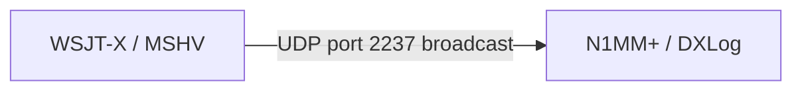
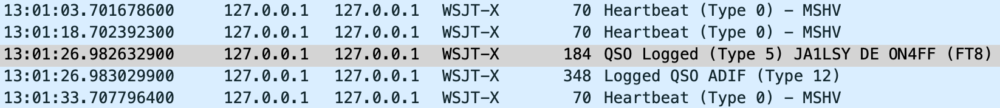
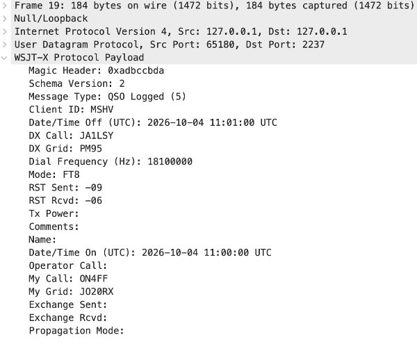

# Wireshark WSJT-X / MSHV UDP port 2237 Dissector

While setting up MSHV in combination with DXLog I wondered which information was sent by MSHV (or WSJT-X) to the QSO logging software.  Typically this is done by sending data via UDP port 2237.



The easiest way was to use Wireshark to snoop on the network packets being sent. Sadly enough Wireshark would only display raw hexadecimal bytes. Time to quickly develop a simple dissector plugin to decode the available information.

A Lua-based Wireshark dissector for **WSJT-X and MSHV and compatible UDP traffic on port 2237**.

The dissector decodes the UDP packets broadcast by WSJT-X/MSHV (and other compatible software) and displays the individual fields in Wireshark, making it easier to inspect, troubleshoot and analyse digital-mode radio software traffic.

The latest version of the Lua script can be found in [my GitHub repository](https://github.com/filipjonckers/wireshark-wsjtx-mshv-2237-dissector).

## Features

* Dissects WSJT-X/MSHV UDP packets on port **2237** or port **2238**
* Decodes and displays packet fields in Wireshark
* Useful for debugging, development and analysing WSJT-X/MSHV integrations

## Installation

Wireshark loads Lua plugins from its personal or global plugin directory.

Download the LUA script from [this repository](https://github.com/filipjonckers/wireshark-wsjtx-mshv-2237-dissector).

### 2. Find your Wireshark plugin directory

In Wireshark, go to: **Help → About Wireshark → Folders**

Look for **Personal Plugins**.

Alternatively, the usual locations are: 

#### Windows

```text
%APPDATA%\Wireshark\plugins
```

#### Linux

```text
~/.local/lib/wireshark/plugins
```

#### macOS

```text
~/.local/lib/wireshark/plugins
```

Create the `plugins` directory if it does not already exist.

### 3. Copy the Lua script

Copy the LUA script from [this repository](https://github.com/filipjonckers/wireshark-wsjtx-mshv-2237-dissector) into the Wireshark **Personal Plugins** directory.

### 4. Restart Wireshark

Close and restart Wireshark so that the Lua dissector is loaded.

## Using the dissector

Start WSJT-X or MSHV and capture the UDP traffic on port **2237**.

You can use this Wireshark display filter:

```text
udp.port == 2237
```



Select a WSJT-X/MSHV packet and expand the decoded protocol tree to inspect the individual fields.



## Requirements

* Wireshark with **Lua scripting support**
* WSJT-X or MSHV using UDP port **2237**

## License

See the [repository](https://github.com/filipjonckers/wireshark-wsjtx-mshv-2237-dissector) license for details.

